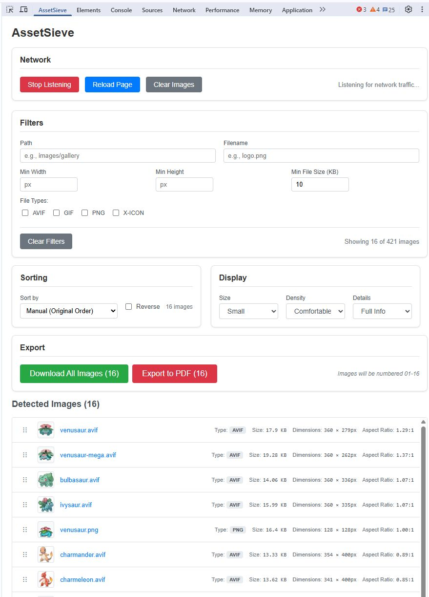

# AssetSieve

**AssetSieve** is a Chrome browser extension that helps you collect and organize images from websites into PDF documents or individual downloads. It's perfect for creating personal archives of digital magazines, comics, or any website where images load as you browse.

**Important: This tool is for personal use only. Please respect copyright laws and only archive content you legally own or have permission to save.**

---

## What Does It Do?

Imagine you're reading a digital magazine or comic online. The images load one by one as you scroll or turn pages. AssetSieve automatically captures these images behind the scenes, letting you:

- **Collect images automatically** as they load on any website
- **Organize and sort** them in the order you want
- **Create a PDF** with all images perfectly arranged
- **Download individual images** to your computer

## Screenshot

_AssetSieve in action: The extension interface shows captured Pokémon images with filtering options, sorting controls, and export functionality. Notice how you can filter by dimensions, file size, search by filename, and see detailed information for each image including size and resolution._

---

## How to Use AssetSieve

### Step 1: Install and Open

1. Install the AssetSieve extension in Chrome
2. Go to any website with images
3. Open Chrome DevTools (F12 or right-click → "Inspect")
4. Click on the "AssetSieve" tab

### Step 2: Start Collecting Images

1. Click the **"Start Listening"** button (green button)
2. Browse the website normally - scroll, click, navigate pages
3. Watch as AssetSieve automatically captures images in the background
4. Click **"Stop Listening"** (red button) when you're done

### Step 3: Organize Your Images

- **Filter out unwanted images**: Set minimum width/height to exclude small icons and ads
- **Search by filename**: Type part of a filename to find specific images
- **Sort automatically**: Choose how to arrange images (by size, filename, etc.)
- **Drag and drop**: Manually reorder images by dragging them into the perfect sequence

### Step 4: Export Your Collection

- **Create a PDF**: Click "Export to PDF" to get one document with each image on its own page
- **Download all images**: Click "Download All Images" to save them as individual files
- **Remove unwanted images**: Click the red × button (visible when hovering over the image preview) on any image you don't want

---

## Perfect For These Use Cases

- **Digital Magazine Collections**: Save issues of magazines you've purchased digitally
- **Comic Book Archives**: Create PDF backups of comics you own
- **Art Galleries**: Collect artwork from museum or gallery websites
- **Educational Materials**: Archive diagrams, charts, and illustrations for study
- **Product Catalogs**: Save product images from shopping sites for comparison

---

## How the PDF Feature Works

When you click "Export to PDF", AssetSieve does something clever:

1. **Opens a new tab** with all your images arranged in order
2. **Formats everything for printing** (each image gets its own page)
3. **Opens the print dialog** automatically
4. **You choose "Save as PDF"** and pick where to save it

No complicated software needed - it uses Chrome's built-in PDF creator!

---

## Tips for Best Results

- **Start listening before browsing**: Turn on image capture before navigating to ensure you don't miss anything
- **Use filters wisely**: Set minimum dimensions (like 500×500 pixels) to exclude tiny icons and buttons
- **Check the order**: Images might not load in the order you expect - use the drag-and-drop feature to fix the sequence
- **Clear between sessions**: Use "Clear Images" to start fresh when moving to a different website or section

---

## Technical Details (For Developers)

**Built with**: React, TypeScript, Chrome Extension APIs  
**Architecture**: Uses Chrome DevTools network monitoring to intercept image requests  
**Image handling**: Converts images to base64 for offline processing and PDF generation  
**Export methods**: Chrome downloads API for individual files, print API for PDF generation

**Key APIs used**:

- `chrome.devtools.network` - Network request monitoring
- `chrome.downloads` - File downloads
- `chrome.tabs` - Tab management for PDF generation
- HTML5 Drag & Drop API - Manual image reordering

---

## Privacy & Legal Notes

- **Your data stays local**: Images are processed in your browser, nothing is sent to external servers
- **Respect copyright**: Only use this tool with content you own or have permission to archive
- **Personal use only**: This tool is designed for personal archiving, not commercial redistribution

---

_AssetSieve helps you organize the digital content you already have access to. Please use responsibly and in accordance with all applicable laws and terms of service._
