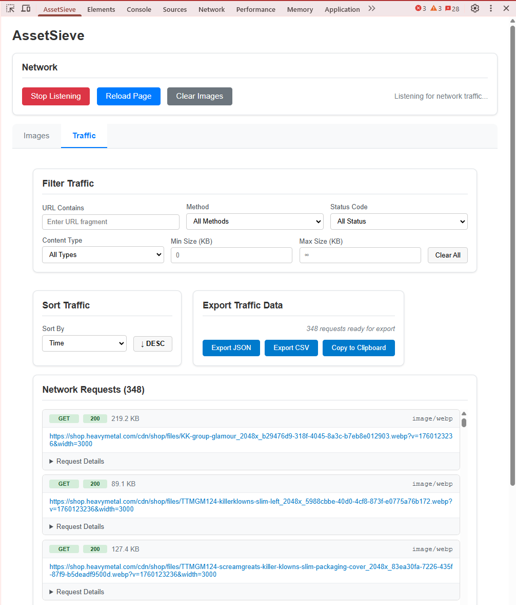

# AssetSieve

**AssetSieve** is a Chrome browser extension that helps you collect and organize images from websites into PDF documents or individual downloads. It's perfect for creating personal archives of digital magazines, comics, or any website where images load as you browse.

**Important: This tool is for personal use only. Please respect copyright laws and only archive content you legally own or have permission to save.**

---

## What Does It Do?

Imagine you're reading a digital magazine or comic online. The images load one by one as you scroll or turn pages. AssetSieve automatically captures these images behind the scenes, letting you:

- **Collect images automatically** as they load on any website
- **Organize and sort** them in the order you want
- **Create a PDF** with all images perfectly arranged
- **Download individual images** to your computer

## Screenshot

_AssetSieve in action: The extension interface shows captured Pokémon images with filtering options, sorting controls, and export functionality. Notice how you can filter by dimensions, file size, search by filename, and see detailed information for each image including size and resolution._

---

## How to Use AssetSieve Images

### Step 1: Install and Open

1. Install the AssetSieve extension in Chrome
2. Go to any website with images
3. Open Chrome DevTools (F12 or right-click → "Inspect")
4. Click on the "AssetSieve" tab

### Step 2: Start Collecting Images

1. Browse the website normally - scroll, click, navigate pages
2. Watch as AssetSieve automatically captures images in the background (the network sniffer is on by default)
3. Click **"Stop Listening"** (red button) when you're done collecting images

### Step 3: Organize Your Images

- **Filter out unwanted images**: Set minimum width/height to exclude small icons and ads
- **Search by filename**: Type part of a filename to find specific images
- **Sort automatically**: Choose how to arrange images (by size, filename, etc.)
- **Drag and drop**: Manually reorder images by dragging them into the perfect sequence

### Step 4: Export Your Collection

- **Create a PDF**: Click "Export to PDF" to get one document with each image on its own page
- **Download all images**: Click "Download All Images" to save them as individual files
- **Remove unwanted images**: Click the red × button (visible when hovering over the image preview) on any image you don't want

---

## How to Use AssetSieve Flippingbook

AssetSieve's **FlippingBook feature** is specifically designed for digital magazines and publications created using the FlippingBook.com platform. When you're browsing these interactive publications, AssetSieve automatically detects and captures the underlying WebP images and SVG overlays that make up each page.

### What It Does

FlippingBook publications typically consist of:

- **WebP images**: High-quality background page images
- **SVG overlays**: Vector graphics containing text, links, and interactive elements

AssetSieve intelligently pairs these assets together and enables you to export your legally accessed content as a consolidated PDF document.

### Step-by-Step Usage

#### Step 1: Access Your FlippingBook Publication

1. Navigate to a magazine or publication created with FlippingBook.com
2. Ensure you have legitimate access (subscription, purchase, or permission)
3. Open Chrome DevTools (F12) and click the **"AssetSieve"** tab
4. Switch to the **"FlippingBook"** tab within AssetSieve

#### Step 2: Configure Detection Settings

1. **Page Pattern**: Adjust the regex pattern if needed (default: `page\d{4}_3\.webp`)
   - This helps AssetSieve identify which images are magazine pages
   - Most FlippingBook publications use the default pattern
2. **Remove Duplicates**: Check this option to avoid duplicate pages with identical paths
   - Useful when the same page loads multiple times during browsing

#### Step 3: Browse and Capture

1. Browse through the FlippingBook publication normally (the network sniffer is on by default)
2. Turn pages, zoom, and navigate as you would typically read
3. AssetSieve automatically captures page assets in the background
4. Watch the FlippingBook counter increase as pages are detected
5. Click **"Stop Listening"** when you're done capturing pages

#### Step 4: Review and Organize

- **View captured pages**: See thumbnails of all detected FlippingBook pages
- **Sort pages**: Use sorting options to arrange pages in the correct reading order
- **Remove unwanted pages**: Delete any accidentally captured non-page images
- **Verify completeness**: Ensure all desired pages have been captured

#### Step 5: Export Your PDF

1. **Set PDF metadata**: Enter a title, author name, and filename for your PDF
2. **Export to PDF**: Click the export button to generate your consolidated document
3. **Additional options**:
   - Download URLs as text file for reference
   - Copy URLs to clipboard for other uses

### Key Features

- **Smart Asset Pairing**: Automatically matches WebP backgrounds with their corresponding SVG overlays
- **Flexible Filtering**: Customizable regex patterns to match different FlippingBook implementations
- **Duplicate Detection**: Removes duplicate pages based on file paths (not full URLs)
- **PDF Customization**: Add metadata like title, author, and custom filenames
- **Quality Preservation**: Maintains original image quality in the final PDF
- **Batch Processing**: Handles entire publications efficiently

### Legal and Ethical Use

**This feature is intended exclusively for legitimate use cases:**

**Appropriate Use:**

- Creating personal backups of magazines you have purchased or subscribed to
- Archiving content you legally own or have licensing rights to access
- Educational use within fair use guidelines and institutional licenses
- Research purposes where you have appropriate academic or professional access

**Prohibited Use:**

- Circumventing paywalls or subscription requirements
- Creating unauthorized copies for redistribution or commercial purposes
- Sharing copyrighted content without proper licensing
- Any use that violates the publisher's terms of service or applicable copyright law

**Important**: AssetSieve is a tool for organizing and preserving content you already have legitimate access to. Users are solely responsible for ensuring their use complies with all applicable laws, terms of service, and licensing agreements. Always respect intellectual property rights and publisher policies.

---

## Tips for Best Results

- **Use filters wisely**: Set minimum dimensions (like 500×500 pixels) to exclude tiny icons and buttons
- **Check the order**: Images might not load in the order you expect - use the drag-and-drop feature to fix the sequence
- **Clear between sessions**: Use "Clear Images" to start fresh when moving to a different website or section

---

## Technical Details (For Developers)

**Built with**: React, TypeScript, Chrome Extension APIs  
**Architecture**: Uses Chrome DevTools network monitoring to intercept image requests  
**Image handling**: Converts images to base64 for offline processing and PDF generation  
**Export methods**: Chrome downloads API for individual files, print API for PDF generation

### Traffic Analysis Tab

AssetSieve includes a comprehensive **Traffic tab** for developers who need to analyze all network requests, not just images. This tab provides:

**Advanced Filtering**:

- Filter by URL fragments, HTTP methods (GET, POST, etc.)
- Filter by status codes (200, 404, 500, etc.) and content types
- Size-based filtering with min/max ranges in KB

**Multi-criteria Sorting**:

- Sort by timing, URL, method, status, size, or content type
- Toggle ascending/descending with visual indicators

**Export Capabilities**:

- Export filtered data as JSON or CSV
- Copy request summaries to clipboard for quick sharing
- All exports work with already-captured data (no re-downloading)

**Visual Request Display**:

- Color-coded method badges and status indicators
- Human-readable file sizes and timing information
- Expandable request details with clickable URLs

This makes AssetSieve useful not just for image collection, but also for network debugging, performance analysis, and API documentation.

**Key APIs used**:

- `chrome.devtools.network` - Network request monitoring
- `chrome.downloads` - File downloads
- `chrome.tabs` - Tab management for PDF generation
- HTML5 Drag & Drop API - Manual image reordering

---

## Privacy & Legal Notes

- **Your data stays local**: Images are processed in your browser, nothing is sent to external servers
- **Respect copyright**: Only use this tool with content you own or have permission to archive
- **Personal use only**: This tool is designed for personal archiving, not commercial redistribution

---

_AssetSieve helps you organize the digital content you already have access to. Please use responsibly and in accordance with all applicable laws and terms of service._
